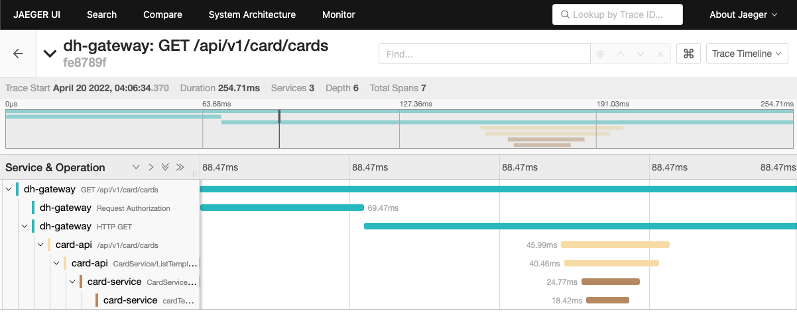

[](https://codecov.io/gh/devopshaven/api-gateway)
[](https://pkg.go.dev/github.com/devopshaven/api-gateway)


# DevopsHaven API gateway

Gateway for DevopsHaven ingress

Before you wanna use the gateway please set the RBAC permission to allow to create a configmap watch by the pod to it's own namespace. You can check the [k8s/roles.yaml](k8s/roles.yaml) file for example configuration.

Docker image: `ghcr.io/devopshaven/api-gateway:latest`

### Tracing

The server implements tracing which uses B3 and W3C header propagators with [OpenTelemetry](https://opentelemetry.io/) standards. 

#### Jaeger tracing screenshot with gateway


## Command line parameters:
- `-addr` listen address (default: 127.0.0.1:8080)
- `-authServer` the authorization server address eg.: `127.0.0.1:5009`. When not set the gateway will **not authorize the requests**! (default: none)
- `-pretty` enables developer friendly pretty (colored) console log instead of default JSON format

## Environment variables:

- `OTEL_EXPORTER_JAEGER_AGENT_HOST` the jaeger agent host jaeger exporter
- `OTEL_EXPORTER_JAEGER_AGENT_PORT` the jaeger agent port for jaeger exporter

### Config example:

The service is reading from the `gateway-config` **ConfigMap** and the watching it for changes. The configuration will be loaded from the `services.yaml` key which should contains the valid YAML configuration for the service. You can see the example configuration below.

```yaml
version: v1
services:
- name: cart
  serviceUrl: cart-service:8080
  paths:
    - /api/cart/v1
  serviceUrl: discount-service-v2:8080
  paths:
    - /api/discount/v2
  serviceUrl: discount-service:8080
  paths:
    - /api/discount/v1
```

You can see the detailed example (kubernetes) deployment in [k8s](k8s/) folder.


<small>Made with ❤️ at DevopsHaven Team</small>
